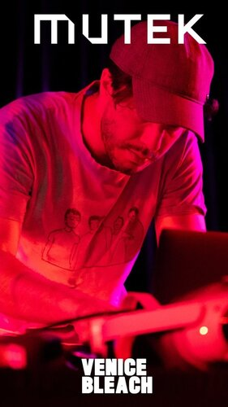
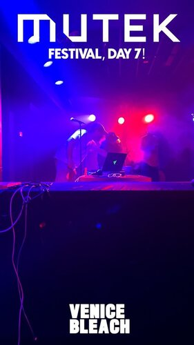

# FORMATIONS

## Auteur(s)

- **Nom de l'auteur :** Venice Bleach (Roman Rappak), artiste et producteur de musique électronique basé entre Paris et Londres.
- **Équipe de production :** Venice Bleach en collaboration avec le studio numérique Ristband.

- **Collaborateurs et partenaires :** Ristband, qui utilise l'intelligence artificielle, les moteurs de jeu et d'autres technologies avancées pour créer des expériences immersives.

## Dates

- **Date de création :** 2023
- **Date de première présentation :** Première mondiale lors du SXSW 2023, à Austin, Texas
- **Première canadienne :** 2024, à la Salle Claude-Léveillée, Place des Arts, Montréal
- **Dates importantes :** FORMATIONS a été bien accueilli au SXSW, remportant le Prix du Public pour l'événement "Future x Music" en 2023.

## Contexte de présentation

- **Lieu de présentation initiale :** FORMATIONS a été présenté pour la première fois au **SXSW 2023**, à Austin, Texas (13 mars - 19 mars 2023).
- **Contexte géographique et culturel :** L'œuvre mélange de manière innovante la musique électronique live et la réalité virtuelle. Elle est présentée dans des festivals internationaux qui explorent l'univers de la musique et des technologies numériques immersives.
- **Autres lieux de présentation :**
  - **SIFF** à Shanghai, Chine (du 14 au 23 juin 2024)
  - **MUTEK 2024** à Montréal, Québec, Canada (du 15 au 29 août 2024)

## Description de l'œuvre

- **Description générale :** "Formations" est une expérience immersive de réalité virtuelle qui intègre des éléments interactifs réactifs à la musique en direct. Les participants, équipés de casques VR, sont plongés dans un environnement virtuel dynamique qui évolue en réponse aux stimuli sonores et visuels.

- **Objectifs de l'œuvre :** Créer une immersion totale en combinant la réalité virtuelle et la musique en direct, afin de repousser les limites de l'interaction entre les médias numériques et les performances artistiques.

- **Public cible :** Enthousiastes de la réalité virtuelle, amateurs de musique immersive et passionnés d'art numérique interactif.

- **Aspects techniques :** Utilisation de moteurs de jeu et de technologies de réalité virtuelle pour concevoir un environnement interactif en temps réel. Les outils utilisés comprennent Premiere Pro pour le montage vidéo et Unreal Engine pour la création d'environnements virtuels interactifs.

- **Processus de création :** Développé avec la technologie propriétaire de Ristband, le processus créatif a impliqué la musique électronique, la conception en réalité mixte et des éléments de la culture gaming, créant ainsi une expérience hybride entre concert et univers virtuel​.

## Composante centrale et fonctionnement

- **Composante centrale :** L'interaction entre la performance musicale en direct et l'environnement virtuel, rendu possible grâce à l'IA et aux moteurs de jeu.
- **Fonctionnement :** L'environnement virtuel réagit en temps réel à la musique jouée, ce qui plonge les participants dans une expérience immersive et interactive unique.
- **Impact :** FORMATIONS représente la prochaine génération de contenu interactif, redéfinissant les possibilités des performances live et des installations artistiques en fusionnant musique et technologie.

## Appréciation et commentaire personnel

- **Pourquoi avoir choisi cette œuvre ?** J'ai choisi Formation parce que c'est un excellent exemple de ce que peut devenir l'art numérique et la musique à l'avenir. Grâce à la technologie, cette œuvre permet de vivre une expérience immersive unique où le public interagit avec la musique et le visuel en temps réel. C'est une nouvelle façon d'impliquer les spectateurs dans une expérience collective et interactive.

## Liens associés

- **Réseaux sociaux :**
  - [Instagram](https://www.instagram.com/venicebleachofficial/)
  - [Spotify](https://open.spotify.com/artist/4H36C537J5QzqeFju01FjI)
  - [Youtube](https://www.youtube.com/channel/UCF9VISjY6RZ4FtXm491lp-Q)
  - [Soundcloud](https://soundcloud.com/venice-bleach-99346330)

## Médiagraphie

- https://www.venicebleachofficial.com/
- https://village-numerique.mutek.org/fr/installations/formations-par-ristband-et-venice-bleach
